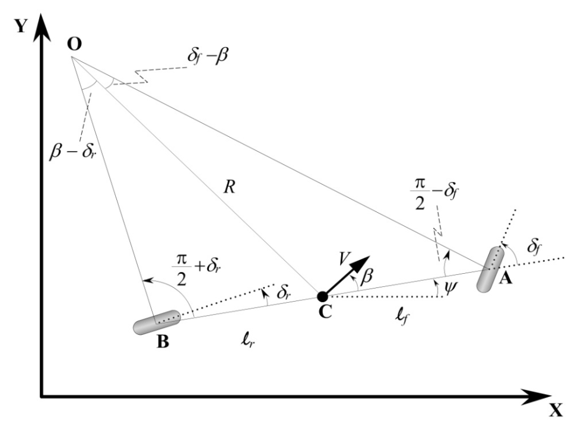

# Controller-for-Autonomous-Vehicle

## Part One Model Setup 系统建模

### 1. Kinematic Model 运动学模型

### **Assumption:** 

> 1. 车辆前后轮均可以转动，左右轮具有相同转角，即前后轮可以分别简化为单车模型 **Bicycle Model**  *(注：对于 **front-wheel-only** 系统，后轮转角可设置为 **zero**)* 
>
> 2. 车辆运动严格限制在 **X-Y** 二维平面，即忽略车辆上下坡运动
>3. 车辆低速运动，前后轮转动产生的轮胎侧滑角为 **zero** ，即前后轮速度矢量方向与转角一致
> 4. 车辆低加速度运动，忽略车辆加速、减速或转向时产生的前后轴负载转移 
> 5. 车身以及悬架系统是刚体 **rigid body** 

### **Parameters Definition:**

| Parameter |   Description    | Parameter | Description  |
| :-------: | :--------------: | :-------: | :----------: |
|   **O**   | **ICR** 旋转中心 |   **C**   |   车辆质心   |
|   **A**   |     前轮中心     |   **B**   |   后轮中心   |
|   **V**   |   车辆质心速度   |   **R**   | 车辆转向半径 |
|  **l_f**  |     前悬长度     |  **l_r**  |   后悬长度   |
|   **β**   |    车辆侧偏角    |   **ψ**   |  车辆航向角  |
|  **δ_f**  |     前轮转角     |  **δ_r**  |   后轮转角   |

（注：车辆航向角**ψ**指车体坐标系x轴正方向与惯性坐标系x轴正方向夹角，车辆侧偏角**β**指车辆速度矢量方向与车体坐标系x轴正方向夹角，详细定义如下：

> **Quotes from *Vehicle Dynamics and Control***
>
> (X, Y) are inertial coordinates of the location of the c.g. of the vehicle, while ***ψ describes the orientation of the vehicle***. The angle ψ is called **the heading angle** of the vehicle. 
>
> The velocity at the c.g. of the vehicle is denoted by V and makes an angle ***β with the longitudinal axis of the vehicle***. The angle β is called **the slip angle** of the vehicle.
>
> **The course angle** for the vehicle is γ = ψ + β .

### **State Space Equation**

> *建立模型，切勿专注于公式的推导结果而忽略公式的推导过程，切勿专注于公式的推导过程而忽略模型的状态量与输入量。*

#### 以车辆质心为参考点的运动学模型

**Step1. 确认模型状态量与输入量**

> 状态量为质心位置 (**X**, **Y**) 与车辆航向角 (**ψ**) ，输入量为车辆速度 (**V**) 与前后轮转角 (**δ_f**与**δ_r**)

**Step2. 推导**

> 对 **TriangleOCA** 与 **TriangleOCB** 应用正弦法则，得：

$$
\begin{align}
{sin(\delta_f-\beta)\over{l_f}} = {sin(\pi/2-\delta_f)\over{R}} \tag{1} \\
{sin(\beta-\delta_r)\over{l_r}} = {sin(\pi/2+\delta_r)\over{R}} \tag{2} \\
{sin(\delta_f)cos(\beta)-sin(\beta)cos(\delta_f)\over{cos(\delta_f)}} = {l_f\over{R}} \tag{3} \\
{sin(\beta)cos(\delta_r)-sin(\delta_r)cos(\beta)\over{cos(\delta_r)}} = {l_r\over{R}} \tag{4} \\
(3) + (4) \quad {tan(\delta_f)cos(\beta)-tan(\delta_r)cos(\beta)} = {l_f+l_r\over{R}} \tag{5} \\ 
联立(3)*l_f与(4)*l_r \quad tan(\beta) = {l_ftan(\delta_r)+l_rtan(\delta_f) \over{l_f+l_r}} \tag{6}
\end{align}
$$

> 基于运动学模型建立的假设条件，车辆低速运动，转向半径变化缓慢，假设车辆方向在惯性坐标系下的变化率等于车辆的角速度，即：

$$
\begin{align}
{\dot\psi} = {\omega} = {{V}\over{R}} \tag{7} \\
联立(5)与(7) \quad {\dot\psi} = {Vcos(β)\over{l_f+l_r}}{[tan(\delta_f)-tan(\delta_r)]} \tag{8}
\end{align}
$$

**Step3. The overall equations of motion**

> 根据模型状态量与输入量，确认运动学模型如下：

$$
\dot X=Vcos(\psi+\beta) \\
\dot Y=Vsin(\psi+\beta) \\
{\dot\psi} = {Vcos(β)\over{l_f+l_r}} {[tan(\delta_f)-tan(\delta_r)]}
$$

> 状态空间方程如下：

$$
\begin{bmatrix} \dot X \\ \dot Y \\ \dot \psi \end{bmatrix} =
\begin{bmatrix}
cos(\psi+\beta) \\ sin(\psi+\beta) \\
cos(β){[tan(\delta_f)-tan(\delta_r)]}\over{l_f+l_r}
\end{bmatrix}*V
$$

> 对于 **front-wheel-only** 系统， **δ_r** 恒等于 **zero** 

$$
\begin{bmatrix} \dot X \\ \dot Y \\ \dot \psi \end{bmatrix} =
\begin{bmatrix}
cos(\psi+\beta) \\ sin(\psi+\beta) \\
cos(β)tan(\delta_f)\over{l_f+l_r}
\end{bmatrix}*V
$$

#### 以后轴中心为参考点的运动学模型 *(front-wheel-only)*

 **Step1. 确认模型状态量与输入量**

> 状态量为后轮中心位置 (**X_r**, **Y_r**) 与车辆航向角 (**ψ**) ，输入量为车辆速度 (**V_r**) 与前轮转角 (**δ_f**)

**Step2. The overall equations of motion**

> 根据模型状态量与输入量，确认运动学模型与状态空间方程如下：

$$
\dot X_r=V_rcos(\psi) \\
\dot Y_r=V_rsin(\psi) \\
{\dot\psi} = {V_rtan(\delta_f)\over{l_f+l_r}}
$$

$$
\begin{bmatrix} \dot X_r \\ \dot Y_r \\ \dot \psi \end{bmatrix} =
\begin{bmatrix}
cos(\psi) \\ sin(\psi) \\
tan(\delta_f)\over{l_f+l_r}
\end{bmatrix}*V_r
$$

#### 以前轴中心为参考点的运动学模型 *(front-wheel-only)*

 **Step1. 确认模型状态量与输入量**

> 状态量为前轮中心位置 (**X_f**, **Y_f**) 与车辆航向角 (**ψ**) ，输入量为车辆速度 (**V_f**) 与前轮转角 (**δ_f**)

**Step2. The overall equations of motion**

> 根据模型状态量与输入量，确认运动学模型与状态空间方程如下：

$$
\dot X_f=V_fcos(\psi+\delta_f) \\
\dot Y_f=V_fsin(\psi+\delta_f) \\
{\dot\psi} = {V_fsin(\delta_f)\over{l_f+l_r}}
$$

$$
\begin{bmatrix} \dot X_f \\ \dot Y_f \\ \dot \psi \end{bmatrix} =
\begin{bmatrix}
cos(\psi+\delta_f) \\ sin(\psi+\delta_f) \\
sin(\delta_f)\over{l_f+l_r}
\end{bmatrix}*V_f
$$

### Linearization and discretization
