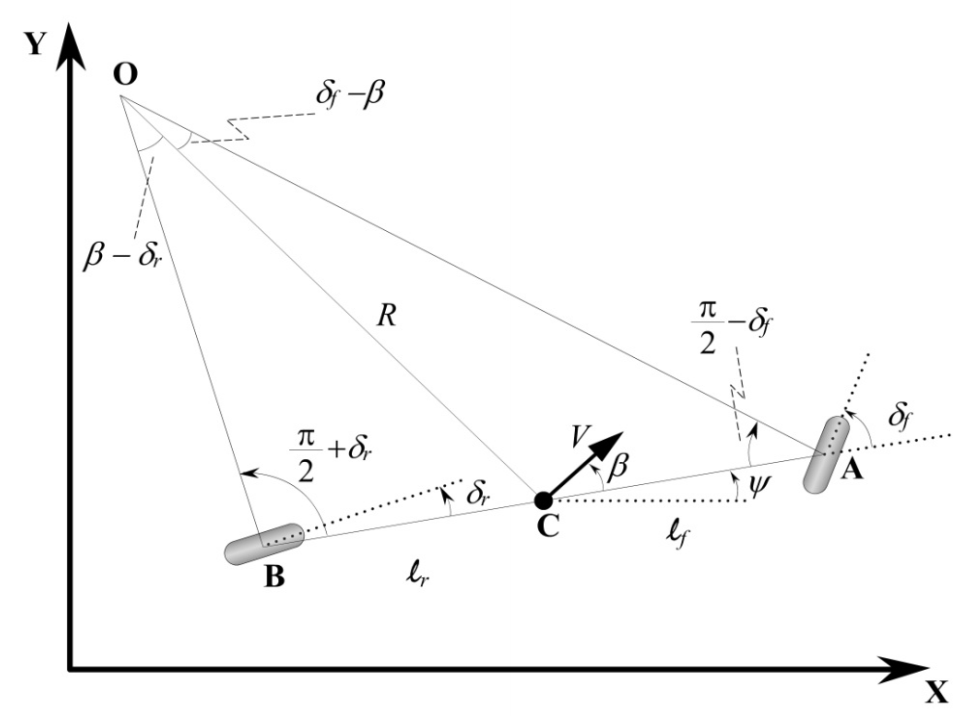

# Controller-for-Autonomous-Vehicle

## Part One Model Setup 系统建模

### 1. Kinematic Model 运动学模型

### **Assumption:** 

> 1. 车辆前后轮均可以转动，左右轮具有相同转角，即前后轮可以分别简化为单车模型 **Bicycle Model**  *(注：对于 **front-wheel-only** 系统，后轮转角可设置为 **zero**)* 
>
> 2. 车辆运动严格限制在 **X-Y** 二维平面，即忽略车辆上下坡运动
>3. 车辆低速运动，前后轮转动产生的轮胎侧滑角为 **zero** ，即前后轮速度矢量方向与转角一致
> 4. 车辆低加速度运动，忽略车辆加速、减速或转向时产生的前后轴负载转移 
> 5. 车身以及悬架系统是刚体 **rigid body** 

### **Parameters Definition:**

| Parameter |   Description    | Parameter | Description  |
| :-------: | :--------------: | :-------: | :----------: |
|   **O**   | **ICR** 旋转中心 |   **C**   |   车辆质心   |
|   **A**   |     前轮中心     |   **B**   |   后轮中心   |
|   **V**   |   车辆质心速度   |   **R**   | 车辆转向半径 |
|  **l_f**  |     前悬长度     |  **l_r**  |   后悬长度   |
|   **β**   |    车辆侧偏角    |   **ψ**   |  车辆航向角  |
|  **δ_f**  |     前轮转角     |  **δ_r**  |   后轮转角   |

***注：车辆航向角ψ指车体坐标系x轴正方向与惯性坐标系x轴正方向夹角，车辆侧偏角β指车辆速度矢量方向与车体坐标系x轴正方向夹角，详细定义如下：***

> **Quotes from *Vehicle Dynamics and Control***
>
> (X, Y) are inertial coordinates of the location of the c.g. of the vehicle, while ***ψ describes the orientation of the vehicle***. The angle ψ is called **the heading angle** of the vehicle. 
>
> The velocity at the c.g. of the vehicle is denoted by V and makes an angle ***β with the longitudinal axis of the vehicle***. The angle β is called **the slip angle** of the vehicle.
>
> **The course angle** for the vehicle is γ = ψ + β .

### **State Space Equation:**

> *建立模型，切勿专注于公式的推导结果而忽略公式的推导过程，切勿专注于公式的推导过程而忽略模型的状态量与输入量。*

#### 以车辆质心为参考点的运动学模型

**Step1. 确认模型状态量与输入量**

> 状态量为质心位置与车辆航向角，输入量为车辆速度与前后轮转角。

**Step2. 推导**

> 对 **TriangleOCA** 与 **TriangleOCB** 应用正弦法则，得：

$$
\begin{align}
{sin(\delta_f-\beta)\over{l_f}} = {sin(\pi/2-\delta_f)\over{R}} \tag{1} \\
{sin(\beta-\delta_r)\over{l_r}} = {sin(\pi/2+\delta_r)\over{R}} \tag{2} \\
{sin(\delta_f)cos(\beta)-sin(\beta)cos(\delta_f)\over{cos(\delta_f)}} &= {l_f\over{R}} \tag{3} \\
{sin(\beta)cos(\delta_r)-sin(\delta_r)cos(\beta)\over{cos(\delta_r)}} &= {l_r\over{R}} \tag{4} \\
(3) + (4) \quad {tan(\delta_f)cos(\beta)-tan(\delta_r)cos(\beta)} &= {l_f+l_r\over{R}} \tag{5} \\ 
联立(3)*l_f与(4)*l_r \quad tan(\beta) = {l_ftan(\delta_r)+l_rtan(\delta_f) \over{l_f+l_r}} \tag{6}
\end{align}
$$

> 基于运动学模型建立的假设条件，车辆低速运动，转向半径变化缓慢，假设车辆方向在惯性坐标系下的变化率等于车辆的角速度，即：

$$
\begin{align}
{\dot\psi} &= {\omega} = {{V}\over{R}} \tag{7} \\
联立(5)与(7) \quad {\dot\psi} &= {Vcos(β)\over{l_f+l_r}}{[tan(\delta_f)-tan(\delta_r)]} \tag{8}
\end{align}
$$

**Step3. The overall equations of motion**

> 根据模型状态量与输入量，确认运动学方程如下：

$$
\begin{align}
\dot X&=Vcos(\psi+\beta) \\
\dot Y&=Vsin(\psi+\beta) \tag{9} \\
{\dot\psi} &= {Vcos(β)\over{l_f+l_r}} {[tan(\delta_f)-tan(\delta_r)]}
\end{align}
$$

$$
\begin{bmatrix} 
\dot X \\
\dot Y \\
\dot \psi 
\end{bmatrix} =
\begin{bmatrix}
cos(\psi+\beta) \\
sin(\psi+\beta) \\
cos(β){[tan(\delta_f)-tan(\delta_r)]}\over{l_f+l_r}
\end{bmatrix}*V \tag{10}
$$

> 对于 **front-wheel-only** 系统， **δ_r** 恒等于 **zero** 

$$
\begin{bmatrix} \dot X \\
\dot Y \\ 
\dot \psi
\end{bmatrix} =
\begin{bmatrix}
cos(\psi+\beta) \\
sin(\psi+\beta) \\
cos(β)tan(\delta_f)\over{l_f+l_r}
\end{bmatrix}*V
$$

#### 以后轴中心为参考点的运动学模型 *(front-wheel-only)*

 **Step1. 确认模型状态量与输入量**

> 状态量为后轮中心位置与车辆航向角，输入量为车辆速度与前轮转角。

**Step2. The overall equations of motion**

> 根据模型状态量与输入量，确认运动学方程如下：

$$
\begin{align}
\dot X_r&=V_rcos(\psi) \\
\dot Y_r&=V_rsin(\psi) \tag{11} \\
{\dot\psi} &= {V_rtan(\delta_f)\over{l_f+l_r}}
\end{align}
$$

$$
\begin{bmatrix} \dot X_r \\
\dot Y_r \\
\dot \psi
\end{bmatrix} =
\begin{bmatrix}
cos(\psi) \\
sin(\psi) \\
tan(\delta_f)\over{l_f+l_r}
\end{bmatrix}*V_r \tag{12}
$$

#### 以前轴中心为参考点的运动学模型 *(front-wheel-only)*

 **Step1. 确认模型状态量与输入量**

> 状态量为前轮中心位置与车辆航向角，输入量为车辆速度与前轮转角

**Step2. The overall equations of motion**

> 根据模型状态量与输入量，确认运动学方程如下：

$$
\begin{align}
\dot X_f&=V_fcos(\psi+\delta_f) \\
\dot Y_f&=V_fsin(\psi+\delta_f) \\
{\dot\psi} &= {V_fsin(\delta_f)\over{l_f+l_r}}
\end{align}
$$

$$
\begin{bmatrix} \dot X_f \\
\dot Y_f \\
\dot \psi
\end{bmatrix} =
\begin{bmatrix}
cos(\psi+\delta_f) \\
sin(\psi+\delta_f) \\
sin(\delta_f)\over{l_f+l_r}
\end{bmatrix}*V_f
$$

### Linearization and Discretization:

> *在车辆运动学建模中得到的非线性系统，需要经过线性化与离散化处理后，在特定工作区不损失原有精度的基础上，更易于系统控制器的设计。*

#### 基于参考系统的线性化算法

对于以后轴中心为参考点的运动学模型 *(front-wheel-only)*：

 **Step1. 确认模型状态量与输入量**

> 状态量为后轮中心位置与车辆航向角，输入量为车辆速度与前轮转角。

**Step2. 运动学方程线性化处理**

> 将上游 **routing** 模块中生成的轨迹，即参考线作为参考系统，通过对参考系统与当前系统之间的偏差进行处理，可以驱动运动学模型跟踪参考线。对于参考系统，任意时刻状态量与控制量均满足：

$$
\begin{align}
\begin{bmatrix} \dot X_r \\
\dot Y_r \\
\dot \psi
\end{bmatrix} &=
\begin{bmatrix}
cos(\psi) \\
sin(\psi) \\
tan(\delta_f)\over{l_f+l_r}
\end{bmatrix}*V_r =
\begin{bmatrix} f_1 \\ 
f_2 \\ 
f_3
\end{bmatrix} \\\\
\dot X_{ref}&=F(X_{ref},u_{ref}) \tag{1} \\ \\
\dot X_{ref}&=[x_{ref},y_{ref},\psi_{ref}]^T \\ 
u_{ref}&=[V_{ref},\delta_{ref}]^T \\
F&=[f_1,f_2,f_3]^T
\end{align}
$$

> 在参考点处进行一阶 **Taylor** 展开，得：

$$
\begin{align}
\dot X&=F(X_{ref},u_{ref})+\frac {d F}{d X}(X-X_{ref})+\frac {d F}{d u}(u-u_{ref}) \tag{2} \\ \\
\frac {d F}{d X} &=
\begin{bmatrix}
\frac {d f_1}{d x_{ref}} & \frac {d f_1}{d y_{ref}} & \frac {d f_1}{d \psi_{ref}} \\ 
\frac {d f_2}{d x_{ref}} & \frac {d f_2}{d y_{ref}} & \frac {d f_2}{d \psi_{ref}} \\ 
\frac {d f_3}{d x_{ref}} & \frac {d f_3}{d y_{ref}} & \frac {d f_3}{d \psi_{ref}}
\end{bmatrix}=
\begin{bmatrix}
0 & 0 & -V_{ref}sin(\psi_{ref}) \\
0 & 0 & V_{ref}cos(\psi_{ref}) \\
0 & 0 & 0
\end{bmatrix}(X-X_{ref}) \\
\frac{d F}{d u} &=
\begin{bmatrix}
\frac {d f_1}{d V_{ref}} & \frac {d f_1}{d \psi_{ref}} \\
\frac {d f_2}{d V_{ref}} & \frac {d f_2}{d \psi_{ref}} \\
\frac {d f_3}{d V_{ref}} & \frac {d f_3}{d \psi_{ref}}
\end{bmatrix}=
\begin{bmatrix}
cos(\psi_{ref}) & 0 \\
sin(\psi_{ref}) & 0 \\
tan(\delta_{ref})\over{l_f+l_r} & V_{ref}\over{(l_f+l_r)cos^2(\delta_{ref})}
\end{bmatrix}(u-u_{ref})
\end{align}
$$

> 经线性化处理后，得线性连续状态方程：

$$
\begin{align}
\dot X_l&=A_lX_l+B_lu_l \tag{3} \\ \\
X_l = \Delta X \quad u_l = \Delta u& \quad A_l = \frac {d F}{d X} \quad B_l = \frac {d F}{d u} 
\end{align}
$$

***注：线性化处理过程中涉及到的偏导数结果均为函数在展开点处(参考点)偏导数的真值，即已知量。***

#### 线性连续系统的离散化

> 对状态误差量（真实系统与参考系统之间的偏差）处理后得到线性连续状态空间，由于状态方程是时间连续的不能直接用于控制器的设计，因此需要对其进行离散化处理。

> 根据积分中值定理中 **ξ** 值取值的不同，分为前向欧拉法、后向欧拉法与中点欧拉法，对(1)式化简后分别对应下文中的(2)(3)(4)式。

$$
\begin{align}
& \int _{T}^{T+dt}{\dot X}dt = \int_ {T}^{T+dt}{(AX+Bu)}dt \\
积分中值定理& \quad X(T+dt)-X(T) = AX(\xi)dt + Bu(\xi)dt \quad \xi\in[T,T+dt] \tag{1} \\ \\
X(\xi)&=X(T) \\
(1) \quad X(T+dt) &= (I+Adt)X(T) + (Bdt)u(T) \tag{2} \\ \\
X(\xi)&=X(T+dt) \\
(1) \quad X(T+dt) &= (I-Adt)^{-1}X(T) + (I-Adt)^{-1}(Bdt)u(T) \tag{3} \\ \\
X(\xi)&=[X(T+dt)+X(T)]/2 \\
(1) \quad X(T+dt) &= (I-Adt/2)^{-1}(I+Adt/2)X(T) + (I-Adt/2)^{-1}(B\sqrt{dt})u(T) \tag{4}
\end{align}
$$

> 以前向欧拉法为例，得到系统的线性离散状态方程：

$$
\begin{align}
X_l(k+1)&=(I+A_ldt)X_l(k) + (B_ldt)u_l(k) \\
&=\begin{bmatrix}
1 & 0 & -V_{ref}sin(\psi_{ref})dt \\
0 & 1 & V_{ref}cos(\psi_{ref})dt \\
0 & 0 & 1
\end{bmatrix}X_l(k)+
\begin{bmatrix}
cos(\psi_{ref})dt & 0 \\
sin(\psi_{ref})dt & 0 \\
tan(\delta_{ref})dt\over{l_f+l_r} & V_{ref}dt\over{(l_f+l_r)cos^2(\delta_{ref})}
\end{bmatrix}u_l(k) \tag{5}
\end{align}
$$
