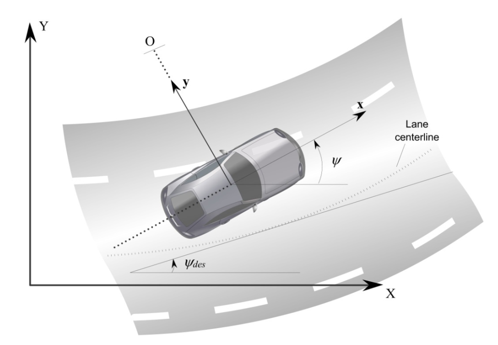
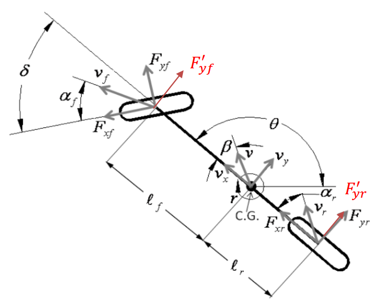

# Controller-for-Autonomous-Vehicle

## Part One Model Setup 系统建模

### 2. Dynamic Model 动力学模型

### **Assumption:** 

> 1. 车辆前后轮均可以转动，左右轮具有相同转角，即前后轮可以分别简化为单车模型 **Bicycle Model**  *(注：对于 **front-wheel-only** 系统，后轮转角可设置为 **zero**)* 
>2. 车辆运动严格限制在 **X-Y** 二维平面，即忽略车辆上下坡运动
> 3. 与运动学模型不同，动力学模型中车辆 **高速** 运动，前后轮转动产生的轮胎侧偏角不为 **zero** ，即前后轮速度矢量方向与转角不再一致
>4. 车辆 **纵向速度视为常量** ，保持低/零加速度运动，忽略车辆加速、减速或转向时产生的前后轴负载转移 
> 5. 车身以及悬架系统是刚体 **rigid body** 
> 5. 纵向与横向控制无相关性，解耦控制

### **Parameters Definition:**

|  Parameter  |            Description             |  Parameter  |            Description             |
| :---------: | :--------------------------------: | :---------: | :--------------------------------: |
|    **O**    |          **ICR** 旋转中心          |   **XY**    |         惯性坐标系 **F_I**         |
|   **xy**    |         车辆坐标系 **F_B**         |    **V**    |            车辆质心速度            |
|   **V_f**   |              前轮速度              |   **V_r**   |              后轮速度              |
|   **l_f**   |              前悬长度              |   **l_r**   |              后悬长度              |
|    **β**    |             车辆侧偏角             |    **ψ**    |             车辆航向角             |
|  **F_yf**   |           等效前轮侧偏力           |  **F_yr**   |           等效后轮侧偏力           |
|   **α_f**   |             前轮侧偏角             |   **α_r**   |             后轮侧偏角             |
| **δ_f (δ)** |              前轮转角              | **δ_r (0)** |              后轮转角              |
|  **𝜃_vf**   | 前轮速度矢量与 **F_Bx** 正方向夹角 |  **𝜃_vr**   | 后轮速度矢量与 **F_Bx** 正方向夹角 |
|  **ψ_des**  | 车辆当前位置在参考线上投影点航向角 | **C_f/C_r** |          前/后轮侧偏刚度           |

***注：车辆航向角ψ指车体坐标系x轴正方向与惯性坐标系x轴正方向夹角，车辆侧偏角β指车辆速度矢量方向与车体坐标系x轴正方向夹角，轮胎侧偏角α指轮胎速度矢量方向与轮胎坐标系x轴正方向夹角，详细定义如下：***

> **Quotes from *Vehicle Dynamics and Control***
>
> (X, Y) are inertial coordinates of the location of the c.g. of the vehicle, while ***ψ describes the orientation of the vehicle***. The angle ψ is called **the heading angle** of the vehicle. 
>
> The velocity at the c.g. of the vehicle is denoted by V and makes an angle ***β with the longitudinal axis of the vehicle***. The angle β is called **the slip angle** of the vehicle.
>
> **The course angle** for the vehicle is γ = ψ + β .
>
> **The slip angle of a tire** α is defined as the angle between the orientation of the tire and the  orientation of the velocity vector of the wheel.

### **State Space Equation:**

> *建立模型，切勿专注于公式的推导结果而忽略公式的推导过程，切勿专注于公式的推导过程而忽略模型的状态量与输入量。*

#### 以车辆质心为参考点的动力学模型 (front-wheel-only)

##### **Step1. 确认模型状态量与输入量**

> 状态量为质心横向位置变化率与车辆航向角变化率，输入量为前轮转角，后轮转角恒等于 **zero** 。

##### **Step2. 推导**

> 将牛顿第二定律应用于车辆沿 **y** 轴的运动，得：

$$
\begin{align}
\Sigma F_y=ma_y=F'_{yf}+F'_{yr} \tag{1}
\end{align}
$$

> 同时，根据车辆绕 **z** 轴的力矩平衡，得：

$$
\begin{align}
I_z\ddot\psi=l_fF'_{yf}-l_rF'_{yr} \tag{2}
\end{align}
$$

> 分析车辆沿 y 轴运动的加速度，得：

$$
\begin{align}
\Delta V_y&=V_x(t_2)sin(\Delta \psi)+V_y(t_2)cos(\Delta \psi)-V_y(t_1) \\ 
\lim\limits_{t_2\to{t_1}} {\Delta V_y\over{\Delta t}}&= \lim\limits_{\Delta t\to 0} {V_x(t_2)sin(\Delta \psi)+V_y(t_2)cos(\Delta \psi)-V_y(t_1)\over{\Delta_t}} \\
a_y&=V_x\dot\psi+\ddot y \quad \Delta \psi \to 0,sin(\Delta \psi) \to \Delta \psi,cos(\Delta \psi) \to 1 \tag{3}
\end{align}
$$

> 分析车辆轮胎侧偏力，得：

$$
\begin{align}
F'_{yf}&=F_{yf}cos(\delta)-F_{xf}sin(\delta)=F_{yf} \quad \delta \to 0,sin(\delta) \to 0,cos(\delta) \to 1 \\
F'_{yr}&=F_{yr} \\
\alpha_f&=\delta-\theta_{vf} \quad 
\alpha_r=-\theta_{vr} \tag{4} \\
F'_{yf}&=2C_{\alpha f}\alpha_f \quad 
F'_{yr}=2C_{\alpha r}\alpha_r \\
tan(\theta_{vf})&={{V_y+l_f \dot\psi}\over{V_x}}=\theta_{vf} \quad
tan(\theta_{vr})={{V_y-l_r \dot\psi}\over{V_x}}=\theta_{vr} \quad V_y=\dot y
\end{align}
$$

> 整理上述公式，得：

$$
\begin{align}
\ddot y=a_y-V_x\dot\psi&={{F'_{yf}+F'_{yr}}\over m}-V_x\dot\psi={{2C_{af}\alpha_{f}+2C_{ar}\alpha_{r}}\over m}-V_x\dot\psi \\
&={{2C_{af}(\delta-\theta_{vf})}+2C_{ar}(-\theta_{vr})\over m}-V_x\dot\psi \\
&=-{2C_{af}+2C_{ar}\over mV_x}\dot y-{2C_{af}l_f-2C_{ar}l_{r}\over mV_x}\dot\psi-V_x\dot\psi+{2C_{af}\over m}\delta \tag{5}
\end{align}
$$

$$
\begin{align}
\ddot\psi={{F'_{yf}l_f-F'_{yr}l_r}\over I_z}&={{2C_{af}\alpha_fl_f-2C_{ar}\alpha_rl_r}\over I_z} \\
&={{2C_{af}l_f(\delta-\theta_{vf})-2C_{ar}l_r(-\theta_{vr})}\over I_z} \\
&=-{{2C_{af}l_f-2C_{ar}l_r}\over I_zV_x}\dot y-{{2C_{af}{l_f}^2+2C_{ar}{l_r}^2}\over I_zV_x}\dot\psi+{2C_{af}l_f\over I_z}\delta \tag{6}
\end{align}
$$

##### **Step3. The overall equations of motion**

> 根据模型状态量与输入量，确认动力学方程如下：

$$
\begin{align}
\ddot y&=-{2C_{af}+2C_{ar}\over mV_x}\dot y-{2C_{af}l_f-2C_{ar}l_{r}\over mV_x}\dot\psi-V_x\dot\psi+{2C_{af}\over m}\delta \tag{7} \\
\ddot\psi&=-{{2C_{af}l_f-2C_{ar}l_r}\over I_zV_x}\dot y-{{2C_{af}{l_f}^2+2C_{ar}{l_r}^2}\over I_zV_x}\dot\psi+{2C_{af}l_f\over I_z}\delta \tag{8}
\end{align}
$$

$$
\begin{bmatrix} 
\dot y \\ 
\ddot y \\ 
\dot \psi \\ 
\ddot \psi 
\end{bmatrix}=
\begin{bmatrix}
0 & 1 & 0 & 0 \\
0 & -{2C_{af}+2C_{ar}\over mV_x} & 0 & -{2C_{af}l_f-2C_{ar}l_{r}\over mV_x}-V_x \\
0 & 0 & 0 & 1 \\
0 & -{{2C_{af}l_f-2C_{ar}l_r}\over I_zV_x} & 0 & -{{2C_{af}{l_f}^2+2C_{ar}{l_r}^2}\over I_zV_x}
\end{bmatrix}
\begin{bmatrix} 
y \\ 
\dot y \\ 
\psi \\ 
\dot \psi 
\end{bmatrix}+
\begin{bmatrix}
0 \\ 
{2C_{af}\over m} \\ 
0 \\ 
{2C_{af}l_f\over I_z}
\end{bmatrix}\delta
\tag{9}
$$

### Linearization and Discretization:

> *在车辆动力学建模中得到的线性系统，需要经过离散化处理后，在特定工作区不损失原有精度的基础上，更易于系统控制器的设计。*

#### 基于参考系统建立面向误差量的动力学模型

对于以车辆质心中心为参考点的动力学模型 *(front-wheel-only)*：

##### **Step1. 确认模型状态量与输入量**

> 状态量为车辆质心到参考线的距离及其变化率与车辆质心航向角与车辆质心在参考线上的投影点航向角之差及其变化率，输入量为前轮转角，后轮转角恒等于 **zero** 。

$$
\begin{align}
\psi_{res}={V_x\over{R}} \quad e_\theta&=\psi-\psi_{res} \quad \dot e_\theta=\dot\psi-\dot\psi_{res} \tag{1} \\
\ddot e_{c.g.}=a_y-a_{res}&=\ddot y+V_x\dot\psi-V_x\dot\psi_{des}=\ddot y+V_x(\dot\psi-\dot\psi_{res})=\ddot y+V_x\dot e_{\theta} \tag{2}
\end{align}
$$

> **with constant Vx (LTI)**

$$
\dot e_{c.g.}=\dot y+V_xe_{\theta} \tag{3}
$$

> **with non-constant Vx (LPV)**

$$
\dot e_{c.g.}=\dot y+\int{V_xe_{\theta}}dt
$$

##### **Step2. 推导**

$$
\begin{align}
\ddot y&=\ddot e_{c.g.}-V_x\dot e_{\theta} \\ 
&=-{2C_{af}+2C_{ar}\over mV_x}(\dot e_{c.g.}-V_xe_{\theta})-({2C_{af}l_f-2C_{ar}l_{r}\over mV_x}+V_x)(\dot e_{\theta}+\dot\psi_{des})+{2C_{af}\over m}\delta \\ 
\ddot e_{c.g.}&=-{2C_{af}+2C_{ar}\over mV_x}\dot e_{c.g.}+{2C_{af}+2C_{ar}\over m}e_{\theta}-{2C_{af}l_f-2C_{ar}l_{r}\over mV_x}\dot e_{\theta}+{2C_{af}\over m}\delta \tag{4}
\end{align}
$$

$$
\begin{align}
\ddot\psi&=\ddot e_{\theta}+\ddot\psi_{des} \\
&=-{{2C_{af}l_f-2C_{ar}l_r}\over I_zV_x}(\dot e_{c.g.}-V_xe_{\theta})-{{2C_{af}{l_f}^2+2C_{ar}{l_r}^2}\over I_zV_x}(\dot e_{\theta}+\dot\psi_{des})+{2C_{af}l_f\over I_z}\delta \\
\ddot e_{\theta}&=-{{2C_{af}l_f-2C_{ar}l_r}\over I_zV_x}\dot e_{c.g.}+{{2C_{af}l_f-2C_{ar}l_r}\over I_z}e_{\theta}-{{2C_{af}{l_f}^2+2C_{ar}{l_r}^2}\over I_zV_x}\dot e_{\theta}+{2C_{af}l_f\over I_z}\delta \tag{5} \\
&-{{2C_{af}{l_f}^2+2C_{ar}{l_r}^2}\over I_zV_x}\dot\psi_{des}-\ddot\psi_{des}
\end{align}
$$

**Step3. The overall equations of motion**

> 根据模型状态量与输入量，确认动力学方程如下：

$$
\begin{bmatrix} 
\dot e_1 \\
\ddot e_1 \\ 
\dot e_2 \\ 
\ddot e_2 
\end{bmatrix}=
\begin{bmatrix}
0 & 1 & 0 & 0 \\
0 & -{2C_{af}+2C_{ar}\over mV_x} & {2C_{af}+2C_{ar}\over m} & -{2C_{af}l_f-2C_{ar}l_{r}\over mV_x} \\
0 & 0 & 0 & 1 \\
0 & -{{2C_{af}l_f-2C_{ar}l_r}\over I_zV_x} & {{2C_{af}l_f-2C_{ar}l_r}\over I_z} & -{{2C_{af}{l_f}^2+2C_{ar}{l_r}^2}\over I_zV_x}
\end{bmatrix}
\begin{bmatrix} 
e_1 \\ 
\dot e_1 \\ 
e_2 \\ 
\dot e_2 
\end{bmatrix}+
\begin{bmatrix}
0 \\ 
{2C_{af}\over m} \\ 
0 \\ 
{2C_{af}l_f\over I_z}
\end{bmatrix}\delta \tag{6}
$$

#### 线性连续系统的离散化

> 对状态误差量（真实系统与参考系统之间的偏差）处理后得到线性连续状态空间，由于状态方程是时间连续的不能直接用于控制器的设计，因此需要对其进行离散化处理。

> 根据积分中值定理中 **ξ** 值取值的不同，分为前向欧拉法、后向欧拉法与中点欧拉法，对(1)式化简后分别对应下文中的(2)(3)(4)式：

$$
\begin{align}
& \int _{T}^{T+dt}{\dot X}dt = \int_ {T}^{T+dt}{(AX+Bu)}dt \\
积分中值定理& \quad X(T+dt)-X(T) = AX(\xi)dt + Bu(\xi)dt \quad \xi\in[T,T+dt] \tag{1} \\
X(\xi)&=X(T) \\
(1) \quad X(T+dt) &= (I+Adt)X(T) + (Bdt)u(T) \tag{2} \\
X(\xi)&=X(T+dt) \\
(1) \quad X(T+dt) &= (I-Adt)^{-1}X(T) + (I-Adt)^{-1}(Bdt)u(T) \tag{3} \\
X(\xi)&=[X(T+dt)+X(T)]/2 \\
(1) \quad X(T+dt) &= (I-Adt/2)^{-1}(I+Adt/2)X(T) + (I-Adt/2)^{-1}(B\sqrt{dt})u(T) \tag{4}
\end{align}
$$
